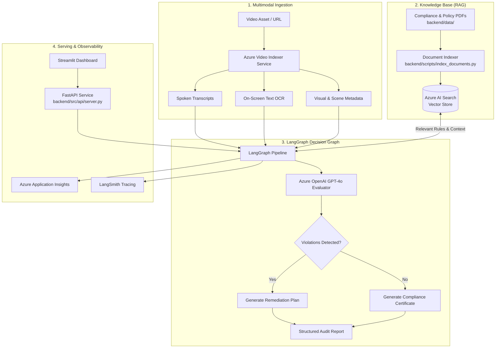

# Multimodal Compliance QA Pipeline (Brand Guardian)

The **Multimodal Compliance QA Pipeline (Brand Guardian)** is an automated, agentic quality assurance and regulatory compliance engine engineered for video, audio, and digital advertising assets. Modern marketing workflows demand strict adherence to platform policies, technical specifications, and legal regulations—such as FTC influencer endorsement guidelines, substantiation of promotional claims, brand safety standards, and platform-specific format constraints (e.g., YouTube Ad specs). Manually verifying high-volume multimedia assets across these diverse rule sets is time-consuming, prone to human error, and difficult to scale.

This pipeline provides an end-to-end, automated auditing framework by orchestrating multimodal AI extraction, retrieval-augmented generation (RAG), and stateful decision graphs. Incoming video assets are ingested through Azure Blob Storage or direct URLs, after which **Azure Video Indexer** extracts spoken dialogue transcripts, on-screen OCR text, visual tags, and scene timestamps. Concurrently, official policy manuals and legal guidelines are chunked and indexed in **Azure AI Search** using high-dimensional **Azure OpenAI** embeddings.

Using **LangGraph**, a multi-step evaluation graph matches extracted multimodal signals against retrieved regulatory constraints. It scrutinizes disclosure placement, prominence, audio-visual alignment, and promotional claims. When violations occur, the engine pinpoints exact timestamps, classifies severity, and generates actionable remediation steps alongside a verifiable audit score. Delivered through an asynchronous **FastAPI** backend, full **OpenTelemetry** and **LangSmith** observability, and an interactive **Streamlit** dashboard, the system safeguards brand reputation while accelerating creative review lifecycles.

---

## Key Features

- **Multimodal Video Ingestion**:
  - Ingest videos from URLs or local files via `yt-dlp` and Azure Blob Storage.
  - Automatically extract speech transcripts, timestamped OCR text, spoken keywords, and visual scene metadata using **Azure Video Indexer**.
- **Domain-Specific Vector Knowledge Base (RAG)**:
  - Ingest and chunk PDF compliance manuals (e.g., FTC Disclosures, Platform Ad Specs).
  - Hybrid semantic retrieval powered by **Azure AI Search** and **Azure OpenAI Embeddings** (`text-embedding-3-small`).
- **Agentic Multi-Step Evaluation (LangGraph)**:
  - Stateful reasoning pipeline evaluating disclosure visibility, claim substantiation, ad specifications, and brand safety.
  - Generates structured violation reports with exact timestamps, severity ratings, and actionable remediation steps.
- **Production API and Observability**:
  - Asynchronous **FastAPI** backend with automated Pydantic schema validation.
  - End-to-end observability with **Azure Application Insights** (OpenTelemetry) and **LangSmith** execution tracing.
- **Interactive Streamlit Dashboard**:
  - Simple UI for media submission, real-time job tracking, and visual compliance inspection.

---

## Architecture Overview



---

## Project Structure

```text
complianceQApipeline/
├── backend/
│   ├── data/                          # Regulatory and compliance guideline PDFs
│   │   ├── 1001a-influencer-guide-508_1.pdf
│   │   └── YouTube_Ad_Specs_Guide_2026.pdf
│   ├── scripts/                       # Data ingestion & indexing utilities
│   │   └── index_documents.py         # Parses PDFs and pushes embeddings to Azure AI Search
│   ├── src/
│   │   ├── api/                       # REST API & Telemetry
│   │   │   ├── server.py              # FastAPI application & endpoints
│   │   │   └── telemetry.py           # Azure OpenTelemetry & monitoring setup
│   │   ├── graph/                     # LangGraph multi-agent compliance pipeline
│   │   │   ├── __init__.py
│   │   │   ├── nodes.py               # Extraction, rule matching, and evaluation nodes
│   │   │   ├── state.py               # TypedDict / Pydantic state definition
│   │   │   └── workflow.py            # Graph construction and compilation
│   │   └── services/                  # External service integrations
│   │       ├── __init__.py
│   │       └── video_indexer.py       # Azure Video Indexer client & polling logic
│   └── tests/                         # Unit and integration test suite
├── .env                               # Environment variables (API keys & endpoints)
├── main.py                            # Application entry point
├── pyproject.toml                     # Python dependencies & package configuration
└── README.md                          # Project documentation
```

---

## Environment Configuration

Create a `.env` file in the project root with the following credentials:

```ini
# Azure Storage (Media Assets)
AZURE_STORAGE_CONNECTION_STRING=""

# Azure OpenAI
AZURE_OPENAI_API_KEY=""
AZURE_OPENAI_ENDPOINT=""
AZURE_OPENAI_API_VERSION="2024-08-01-preview"
AZURE_OPENAI_CHAT_DEPLOYMENT="gpt-4o"
AZURE_OPENAI__EMBEDDING_DEPLOYMENT="text-embedding-3-small"

# Azure AI Search
AZURE_SEARCH_ENDPOINT=""
AZURE_SEARCH_API_KEY=""
AZURE_SEARCH_INDEX_NAME="compliance-guidelines-index"

# Azure Video Indexer
AZURE_VI_NAME=""
AZURE_VI_LOCATION="eastus"
AZURE_VI_ACCOUNT_ID=""
AZURE_SUBSCRIPTION_ID=""
AZURE_RESOURCE_GROUP=""

# Azure Application Insights (Observability)
APPLICATIONINSIGHTS_CONNECTION_STRING=""

# LangSmith Tracing
LANGCHAIN_TRACING_V2=true
LANGCHAIN_ENDPOINT="https://api.smith.langchain.com"
LANGCHAIN_API_KEY=""
LANGCHAIN_PROJECT="brand-guardian-prod"
```

---

## Getting Started

### 1. Prerequisites
- Python 3.11+
- [uv](https://docs.astral.sh/uv/) (recommended) or `pip`

### 2. Installation

Install all project dependencies:
```bash
# Using uv (fast)
uv sync

# Or using standard pip
pip install -e .
```

### 3. Index Compliance Guidelines into Azure AI Search

Extract and index the guideline documents located in `backend/data/`:
```bash
python backend/scripts/index_documents.py
```

### 4. Run the FastAPI Server

Launch the backend API server:
```bash
uvicorn backend.src.api.server:app --host 0.0.0.0 --port 8000 --reload
```
Interactive API docs will be available at: [http://localhost:8000/docs](http://localhost:8000/docs).

### 5. Launch the Streamlit Dashboard

```bash
streamlit run frontend/app.py
```

---

## Pipeline Execution Workflow

1. **Ingest Media**: Video submitted via URL or direct upload is uploaded to Azure Storage and submitted to Azure Video Indexer.
2. **Feature Extraction**: Transcripts, OCR snippets, and scene timestamps are structured into the graph state.
3. **Policy Retrieval**: Relevant sections from FTC Guidelines and Ad Specifications are retrieved from Azure AI Search based on the extracted content.
4. **Compliance Audit**: Azure OpenAI evaluates:
   - **Disclosure Placement**: Are required disclosures clear, conspicuous, and placed above the fold or within audible speech?
   - **Claim Substantiation**: Are unsubstantiated performance claims made?
   - **Format Specifications**: Does the asset meet platform duration, aspect ratio, and audio levels?
5. **Report Generation**: An actionable scorecard with timestamped citations and recommended fixes is outputted.

---

## License

This project is licensed under the MIT License.
